# Ros Watch Shop — Website Bán Đồng Hồ Trực Tuyến


## Mục lục

- [Giới thiệu dự án](#giới-thiệu-dự-án)
- [Chức năng chính](#chức-năng-chính)
- [Công nghệ sử dụng](#công-nghệ-sử-dụng)
- [Kiến trúc hệ thống](#kiến-trúc-hệ-thống)
- [Giao diện hệ thống](#giao-diện-hệ-thống)
- [Hướng dẫn cài đặt](#hướng-dẫn-cài-đặt)
- [Hướng dẫn chạy chương trình](#hướng-dẫn-chạy-chương-trình)
- [Kết quả đạt được](#kết-quả-đạt-được)
- [Hạn chế hiện tại](#hạn-chế-hiện-tại)
- [Hướng phát triển trong tương lai](#hướng-phát-triển-trong-tương-lai)
- [Tác giả](#tác-giả)

---

## Giới thiệu dự án

**Ros Watch Shop** là website thương mại điện tử bán đồng hồ trực tuyến, xây dựng theo mô hình **B2C** — doanh nghiệp bán hàng trực tiếp cho khách hàng cuối.

Website giúp khách hàng xem sản phẩm, tìm kiếm, thêm vào giỏ hàng, đặt hàng và thanh toán trực tuyến; đồng thời cung cấp khu vực quản trị để quản lý sản phẩm, đơn hàng, người dùng và thống kê kinh doanh.

**Đối tượng sử dụng:** khách vãng lai (xem & tìm kiếm), khách hàng đã đăng ký (mua hàng, theo dõi đơn), quản trị viên (vận hành cửa hàng).

---

## Chức năng chính

### Khách hàng

- Duyệt trang chủ: banner, top sản phẩm bán chạy, lọc theo thương hiệu, tìm kiếm
- Xem chi tiết sản phẩm, đánh giá sao, thêm vào giỏ hàng
- Quản lý giỏ hàng, thanh toán COD hoặc VNPay
- Đăng ký / đăng nhập, quên mật khẩu qua email, cập nhật hồ sơ
- Xem lịch sử đơn hàng, trang giới thiệu và liên hệ

### Quản trị viên

- Quản lý thương hiệu, sản phẩm (thêm/xóa, upload ảnh)
- Quản lý đơn hàng, cập nhật trạng thái
- Quản lý người dùng, phân quyền
- Xem biểu đồ thống kê doanh thu, sản phẩm bán chạy, đánh giá cao

---

## Công nghệ sử dụng

| Tầng | Công nghệ |
|------|-----------|
| Frontend | React, React Router, Redux Toolkit, Tailwind CSS, DaisyUI, Axios |
| Backend | Java 17, Spring Boot, Spring Security, Spring Data JPA |
| Cơ sở dữ liệu | Microsoft SQL Server |
| Xác thực | JWT, BCrypt |
| Thanh toán | VNPay Sandbox |
| Email | Gmail SMTP (quên mật khẩu), EmailJS (form liên hệ) |
| Triển khai | Docker (backend), GitHub Pages (frontend) |

---

## Kiến trúc hệ thống

Hệ thống gồm **React SPA** (giao diện người dùng) giao tiếp với **Spring Boot REST API** (xử lý nghiệp vụ), kết nối **SQL Server** lưu trữ dữ liệu. Ảnh sản phẩm được lưu trên server và phục vụ qua API.

```
[Trình duyệt] → [React Frontend :3000] → [Spring Boot API :8080] → [SQL Server]
```

---

## Giao diện hệ thống

*Ảnh chụp màn hình thực tế từ đồ án — lưu tại `docs/screenshots/ui/`.*

### Trang chủ

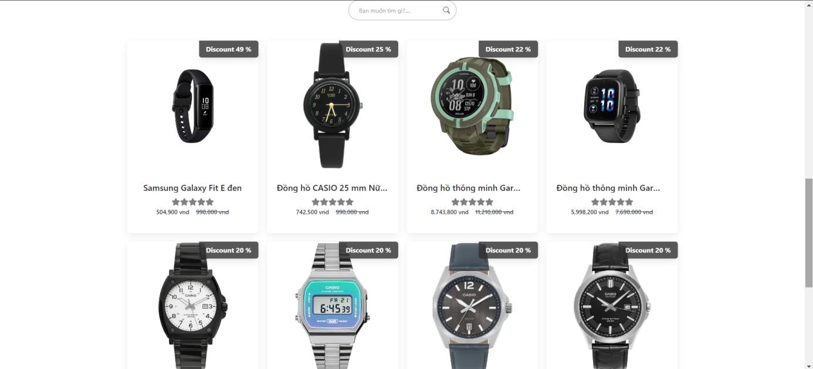

Trang chủ hiển thị banner, danh mục thương hiệu, sản phẩm nổi bật và ô tìm kiếm.

### Trang giới thiệu

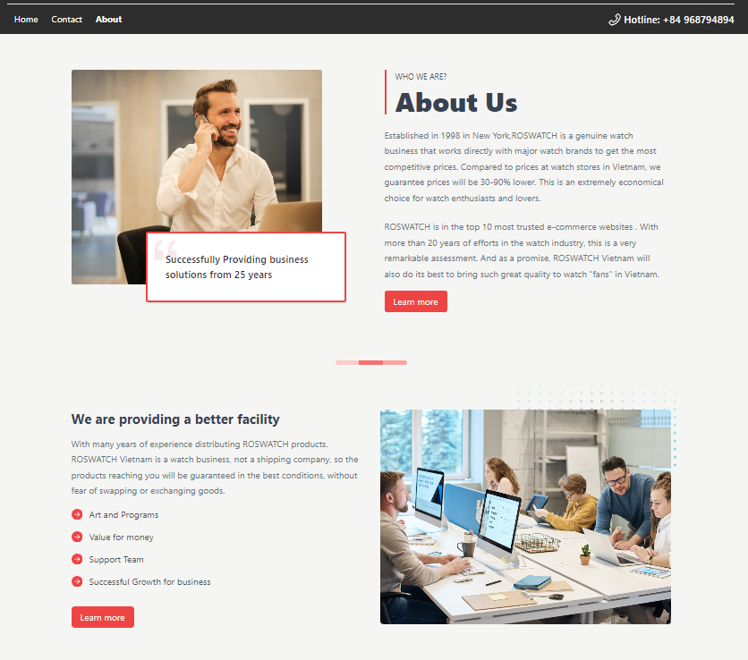

Giới thiệu thương hiệu ROSWATCH và cam kết với khách hàng.

### Trang liên hệ

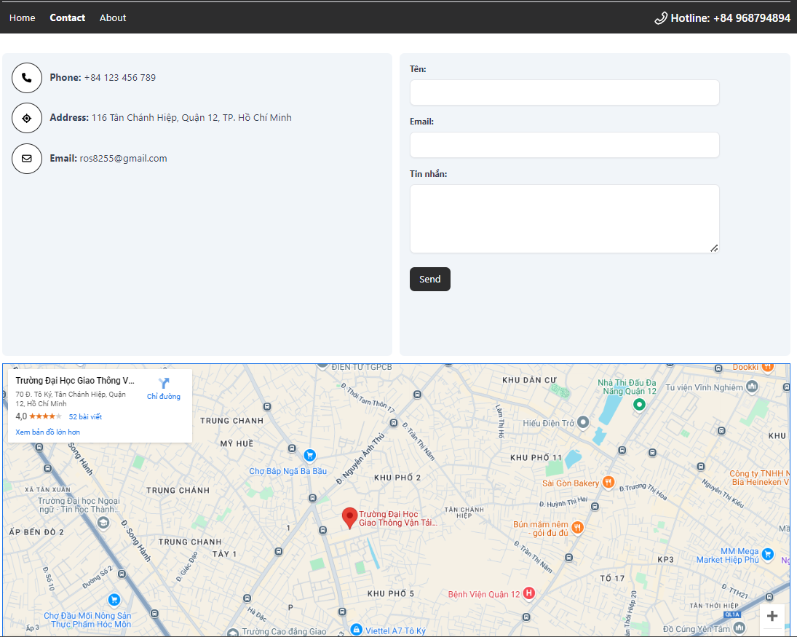

Form liên hệ kèm thông tin hotline và địa chỉ cửa hàng.

### Đăng ký tài khoản

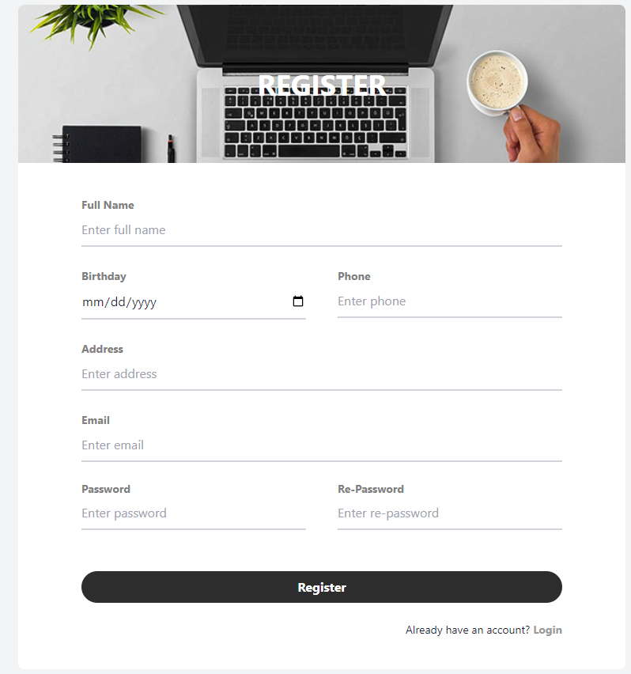

Form đăng ký tài khoản khách hàng mới.

### Đăng nhập

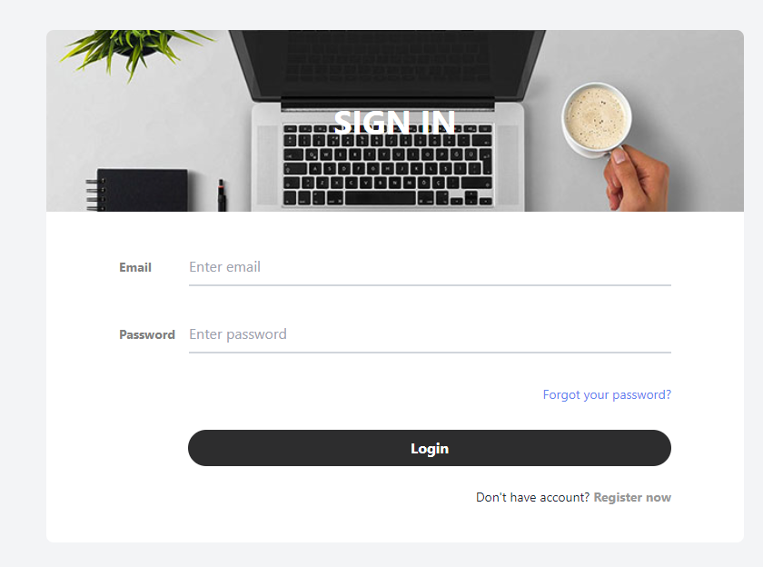

Form đăng nhập và liên kết quên mật khẩu.

### Giỏ hàng

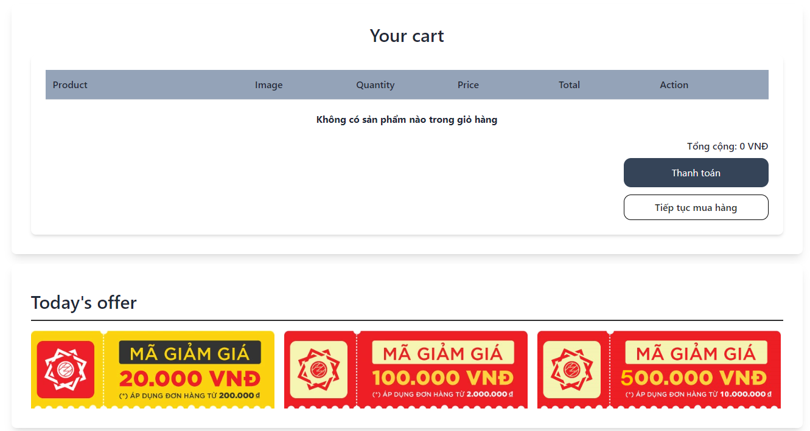

Quản lý sản phẩm trong giỏ, điều chỉnh số lượng và tiến hành thanh toán.

### Hồ sơ cá nhân

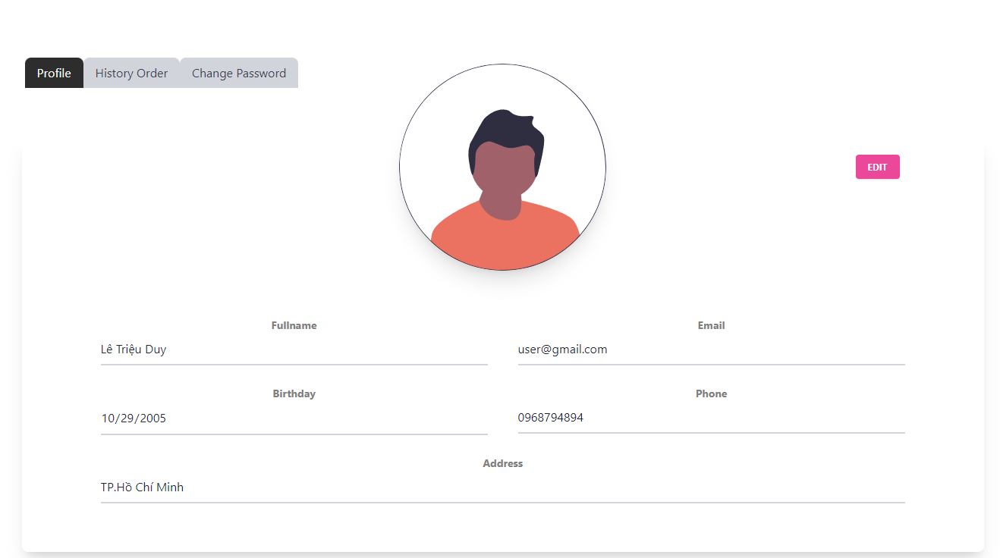

Cập nhật thông tin người dùng và đổi mật khẩu.

### Lịch sử đơn hàng

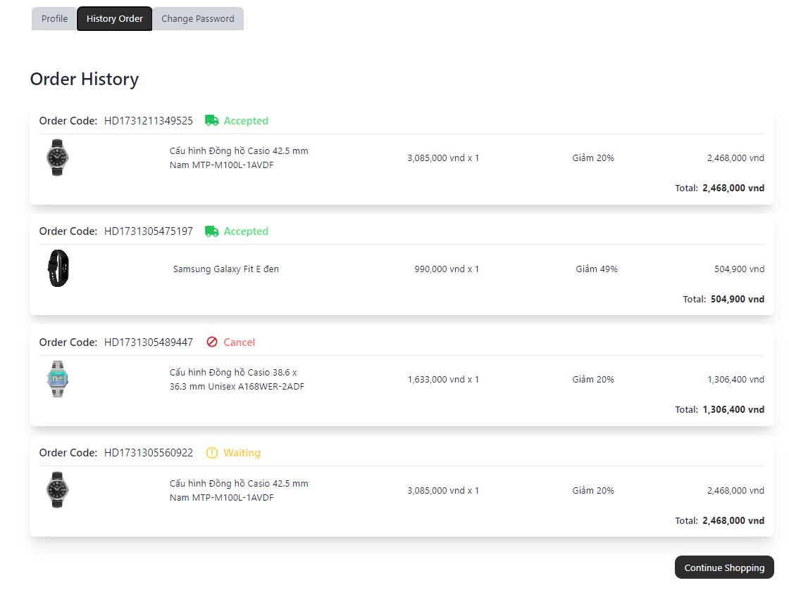

Theo dõi các đơn hàng đã đặt và trạng thái xử lý.

### Quản lý thương hiệu (Admin)

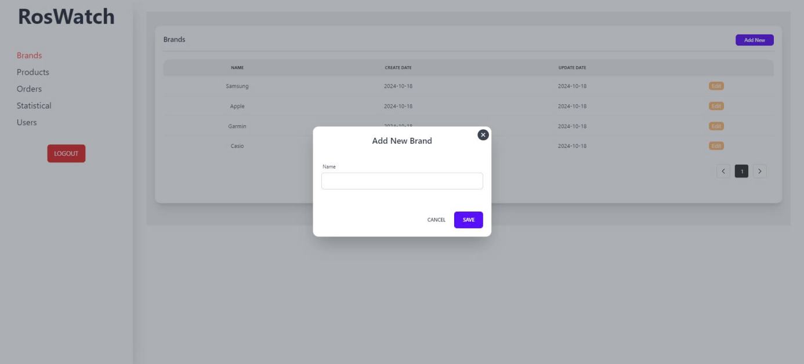

Thêm và quản lý danh mục thương hiệu đồng hồ.

### Quản lý sản phẩm (Admin)

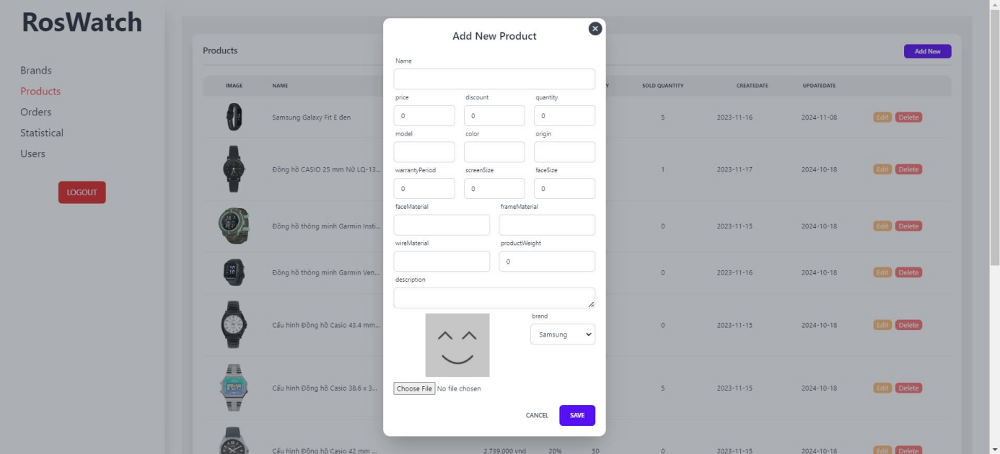

Danh sách sản phẩm, thêm mới kèm upload hình ảnh.

### Quản lý người dùng (Admin)

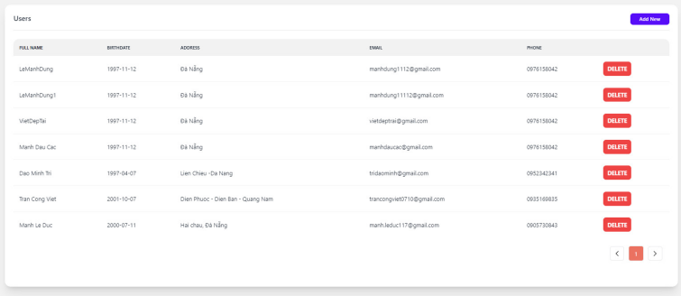

Xem và quản lý tài khoản khách hàng trên hệ thống.

### Quản lý đơn hàng (Admin)

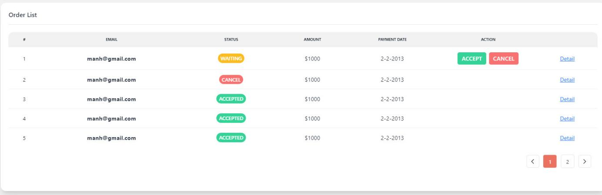

Theo dõi và cập nhật trạng thái đơn hàng.

### Thống kê (Admin)

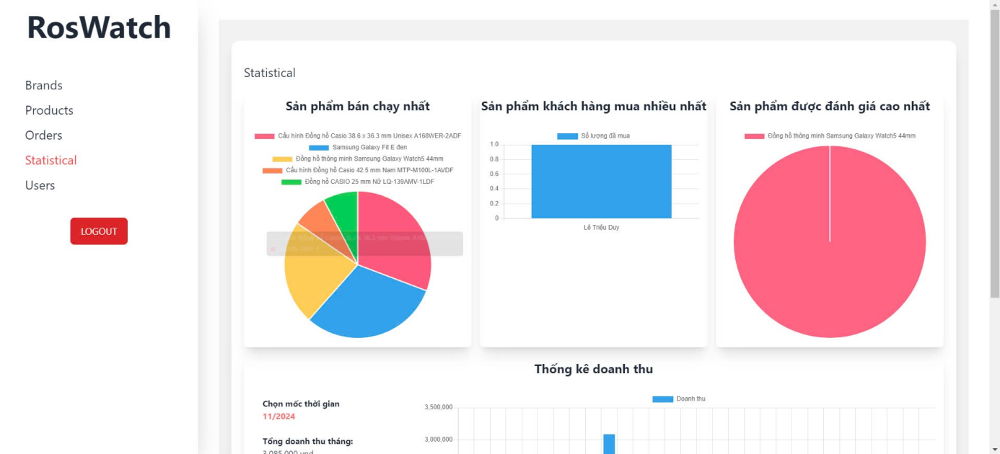

Biểu đồ doanh thu, sản phẩm bán chạy và đánh giá cao nhất.

---

## Hướng dẫn cài đặt

**Yêu cầu:** Node.js ≥ 16, JDK 17, Maven, Microsoft SQL Server.

```bash
git clone https://github.com/glamour29/RosWatch8.git
cd RosWatch8
```

**Backend:**

```bash
cd BE/Watch-Shop-BE/WatchShop
cp src/main/resources/application.properties.template src/main/resources/application.properties
# Chỉnh sửa thông tin SQL Server và Gmail SMTP trong application.properties
mvn clean install -DskipTests
```

**Frontend:**

```bash
cd FE/Watch-Shop-FE
cp .env.template .env
npm install
```

Khởi tạo database `watchshop` bằng các script trong thư mục `BE/Watch-Shop-BE/WatchShop/SQL/`.

---

## Hướng dẫn chạy chương trình

**Backend** (port 8080):

```bash
cd BE/Watch-Shop-BE/WatchShop
mvn spring-boot:run
```

**Frontend** (port 3000):

```bash
cd FE/Watch-Shop-FE
npm start
```

Truy cập: [http://localhost:3000/client](http://localhost:3000/client)

| Tài khoản admin | Giá trị |
|-----------------|---------|
| Email | `admin@gmail.com` |
| Mật khẩu | `123456` |

---

## Kết quả đạt được

- Hoàn thiện website TMĐT bán đồng hồ với đầy đủ luồng mua hàng trực tuyến
- Giao diện khách hàng và quản trị viên tách biệt, thân thiện
- Tích hợp đăng nhập JWT, thanh toán VNPay, gửi email quên mật khẩu
- Trang admin với quản lý sản phẩm, đơn hàng, người dùng và biểu đồ thống kê

---

## Hạn chế hiện tại

- Dự án phục vụ mục đích học tập, chưa tối ưu cho môi trường production
- Phân quyền API chưa được enforce chặt ở tầng backend
- Thanh toán VNPay đang dùng môi trường Sandbox

---

## Hướng phát triển trong tương lai

- Tăng cường bảo mật và phân quyền API
- Tích hợp cổng thanh toán production
- Tối ưu hiệu năng, responsive mobile
- Upload ảnh lên cloud storage

---

# RosWatch

Developed by Lê Triệu Duy.

Licensed under GPL-3.0.

*Đồ án môn Thương mại điện tử — Trường Đại học Giao thông Vận tải TP. HCM*
